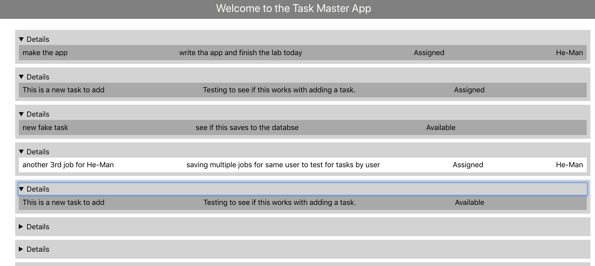

# Task Master

This is an app that allows a user to track tasks that need to be done.  A user can save a task and then update its status as it gets assigned, accepted, completed, etc.

# API
Uses React to connect to the online database and render the data  

# [Deployed Back-End Site](http://taskmaster-env.txmi2mw3a9.us-east-2.elasticbeanstalk.com)

# [Deployed Front-End Site](http://rjbrons-taskmaster-fe.s3-website.us-east-2.amazonaws.com/)

## Screen Shots

